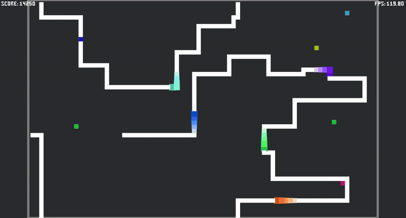

# Snake Rust Demo

Realization of classic snake game on Rust.

[Open web version 🌏](https://mvodya.github.io/snake-rs/)



## Build

For Windows/MacOS/Linux:

```bash
cargo build
```

For WebAssembly (`wasm32-unknown-unknown` target):

```bash
cargo build --release --target wasm32-unknown-unknown --verbose

# Install wasm bindgen
cargo install wasm-bindgen-cli

wasm-bindgen --no-typescript --target web --out-dir ./web/ --out-name "${PROJECT_NAME}" ./target/wasm32-unknown-unknown/release/${PROJECT_NAME}.wasm
```

## Run

For Windows/MacOS Linux:

* Use builded executable
* or just run:

```bash
cargo run
```

For WebAssembly:

```bash
# Install webasm server runner
cargo install wasm-server-runner

# Then, you can run
cargo run --target wasm32-unknown-unknown

# ...or you can install http server (or use your own)
cargo install simple-http-server

cd ./web/
simple-http-server
```

## Controls

Keyboard ⌨:

* WASD or keyboard arrows - change snake head direction
* Shift - increase speed of snake moving

Gamepad 🎮:
* D-Pad buttons - change snake head direction
* Right trigger or bump - increase speed of snake moving
